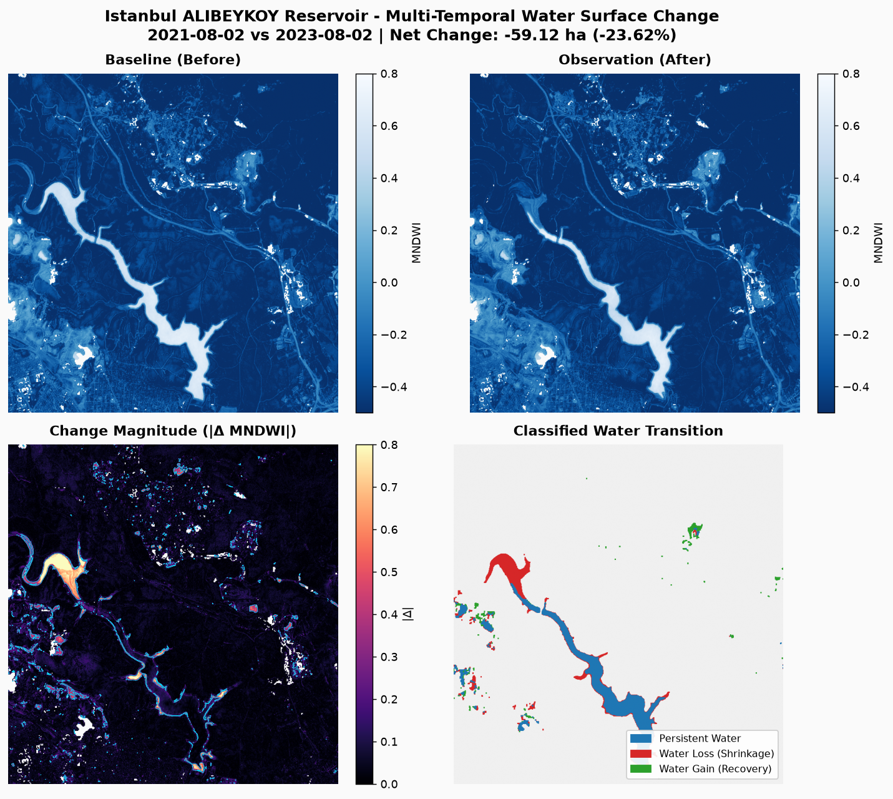

# sentinel-diff

> Multi-temporal satellite change detection and environmental monitoring from open Sentinel-2 surface reflectance data.

`sentinel-diff` is an open, reproducible command-line tool and Python library for detecting surface water body changes over time from optical satellite observations without requiring commercial GIS software or proprietary cloud platforms.

The current pipeline queries public SpatioTemporal Asset Catalogs (STAC), streams Cloud-Optimized GeoTIFF (COG) crops on demand, applies Scene Classification Layer (SCL) cloud masking, and computes the Modified Normalized Difference Water Index (MNDWI) to quantify surface water gains and losses.

---

## Verified Status & Features

Implementation progress is tracked against the codebase in [`PLAN.md`](PLAN.md). Only features wired into the executable pipeline are claimed below:

* **Zero Credentials / Open Data:** Queries public Sentinel-2 L2A collections anonymously via the Microsoft Planetary Computer or AWS Earth Search STAC endpoints (`--provider pc|earthsearch`).
* **Windowed Streaming:** Fetches bounding box subsets on demand via Cloud-Optimized GeoTIFF (COG) HTTP range requests—no full granule downloads required.
* **Radiometric Harmonisation:** Reads `s2:processing_baseline` from each STAC item and removes the +1000 DN BOA offset introduced with processing baseline 04.00, so pre-2022 and Collection-1 reprocessed scenes are compared on the same reflectance scale.
* **Scene Pairing:** Deduplicates reprocessed products, then picks the pair with the smallest circular day-of-year distance (cloud cover as tiebreaker) to minimise seasonal bias.
* **Spectral Water Delineation:** Automated SCL valid-pixel masking (filtering clouds, shadows, and defective pixels) and vectorized MNDWI computation (*NDVI and NDBI are implemented in `indices.py` but not yet wired to `analyze`*).
* **Consistent Morphological Cleaning:** A 3×3 opening/closing plus minimum-component filter (`--min-component-px`, default 6 px = 600 m²) is applied to each scene's water mask **once**; the hectare metrics and the figure are derived from the same cleaned masks, so the numbers and the picture always agree.
* **Diagnostic Change Analysis:** Bi-temporal Change Vector Analysis (CVA) magnitude heatmap with the automated Otsu change threshold outlined on the panel.  
  *(Note: CVA magnitude and Otsu thresholding are diagnostic layers only; water classification and hectare accounting use MNDWI > 0).*
* **Quantitative Accounting & Reports:** Computes surface water transition metrics (persistent water, shrinkage, expansion, net change) in hectares with full provenance metadata, outputs a 4-panel publication-ready diagnostic figure, and generates a standalone single-file HTML report (`reports/interactive/<preset>_report.html`): a before/after MNDWI swipe slider with a toggleable water-transition overlay, metric cards, legend and a provenance table (scene IDs, dates, cloud cover, processing baselines, BOA offsets, parameters). All imagery is embedded as base64 PNG, so the file has no external scripts, fonts, images or relative links.
* **GIS Export (QGIS-ready):** `analyze` writes the classified transition map as a georeferenced single-band uint8 GeoTIFF in the scene's native UTM CRS (`reports/rasters/<preset>_transition.tif`; codes 0 background, 1 persistent water, 2 water loss, 3 water gain, 255 nodata; deflate-compressed) and as a WGS-84 GeoJSON FeatureCollection (`reports/vectors/<preset>_transition.geojson`) with one polygon per connected component carrying `class_code`, `class_name` and `area_ha` computed from the native pixel count. Only `rasterio` and the standard library are used (no geopandas/fiona). Disable with `--no-export`. Verified by `tests/test_export.py` and the export assertions in `tests/test_analyze_e2e.py`.
* **Offline End-to-End Test:** `tests/test_analyze_e2e.py` runs the complete `analyze` command against stub STAC items backed by local GeoTIFFs and asserts exact hectare values.

---

## Results: Istanbul Alibeyköy Reservoir (2021 vs 2023)

The pipeline was executed to evaluate the severe late-summer drought across Istanbul's **Alibeyköy Reservoir**, comparing DOY-matched cloudless acquisitions from **2021-08-02** against **2023-08-02**:

```bash
sentinel-diff analyze --preset alibeykoy --before-date "2021-08-01/2021-08-31" --after-date "2023-08-01/2023-08-31"
```

### Quantitative Metrics (`reports/alibeykoy_metrics.json`)

| Metric | Value |
|---|---|
| **Preset Area** | `alibeykoy` (BBox: `[28.87, 41.10, 28.96, 41.17]`) |
| **Baseline Date** | 2021-08-02 (`S2B_MSIL2A_20210802T084559_R107_T35TPF_20210802T203106`, cloud: 0.72%) |
| **Observation Date** | 2023-08-02 (`S2B_MSIL2A_20230802T084609_R107_T35TPF_20241025T040038`, cloud: 0.35%) |
| **Processing Baselines** | 03.00 (no BOA offset) vs 05.10 (+1000 DN offset removed) |
| **Morphological Cleaning** | `--min-component-px 6` (default) |
| **Baseline Water Area** | **250.27 ha** |
| **Observation Water Area** | **191.15 ha** |
| **Persistent Water Area** | **167.36 ha** |
| **Water Loss (Drought / Shrinkage)** | **82.91 ha** |
| **Water Gain (Inflow / Expansion)** | **23.79 ha** |
| **Net Surface Water Change** | **−59.12 ha (−23.62 %)** |
| **Otsu threshold on \|ΔMNDWI\|** | 0.262 |

Running the same pair with `--min-component-px 0` (no morphological cleaning) yields 284.63 ha → 231.29 ha, net −53.34 ha (−18.74 %). The ~34 ha difference in the baseline is isolated speckle and features narrower than 3 pixels (mostly bright urban roofs west of the reservoir) that the default cleaning removes. The BOA offset harmonisation leaves the hectare figures unchanged in this run, because water classification depends only on the sign of MNDWI (see METHODOLOGY §6 for the one theoretical exception); it corrects the |ΔMNDWI| panel and the Otsu threshold.

The run also writes `reports/vectors/alibeykoy_transition.geojson` (310 polygons; per-class areas sum to exactly the metrics above), `reports/rasters/alibeykoy_transition.tif` (git-ignored) and the standalone swipe-slider report `reports/interactive/alibeykoy_report.html` (0.78 MB, all imagery embedded).

#### Cross-provider check (AWS Earth Search)

The same command with `--provider earthsearch` selects `S2B_35TPF_20210802_1_L2A` (Collection-1 reprocessed, baseline 05.00, offset already applied by the provider) and `S2B_35TPF_20230802_0_L2A` (baseline 05.09) and yields 276.65 ha → 209.44 ha, net −67.21 ha (−24.29 %). The ~26 ha baseline difference comes from ESA's Collection-1 reprocessing of the 2021 acquisition (different atmospheric correction and Scene Classification Layer), not from the pipeline: Planetary Computer only serves the original baseline 03.00 product for that date. Treat cross-provider numbers as different input products, not as a reproducibility failure.

### Diagnostic Figure

The pipeline outputs a publication-quality 4-panel diagnostic figure saved to `reports/figures/alibeykoy_change_analysis.png`:



* **Top Left & Right:** Baseline (2021) and observation (2023) MNDWI water index fields.
* **Bottom Left:** $|\Delta\text{MNDWI}|$ change magnitude; the cyan outline is the automated Otsu change mask.
* **Bottom Right:** Classified water transitions (Persistent Water in blue, Water Loss in red, Water Gain in green), drawn from the same cleaned masks that produce the hectare metrics.

---

## Repository Layout

```
sentinel-diff/
├── PLAN.md              # Ground-truth roadmap with verified [x], [~], [ ] status
├── src/sentinel_diff/
│   ├── catalog.py       # STAC query client for spatio-temporal asset discovery
│   ├── ingest.py        # COG windowed streaming reader
│   ├── mask.py          # Scene classification layer (SCL) cloud/shadow filter
│   ├── indices.py       # Spectral indices (MNDWI, NDWI, NDVI, NDBI)
│   ├── cva.py           # Change Vector Analysis & Otsu/MAD thresholding
│   ├── metrics.py       # Hectare & transition area accounting
│   ├── export.py        # GeoTIFF + GeoJSON export of the transition map (QGIS-ready)
│   ├── viz.py           # 4-panel diagnostic figure & single-file HTML swipe-slider report
│   └── cli.py           # Command-line interface
├── reports/
│   ├── alibeykoy_metrics.json
│   ├── figures/alibeykoy_change_analysis.png
│   ├── interactive/alibeykoy_report.html   # standalone swipe-slider report (imagery embedded)
│   ├── rasters/         # <preset>_transition.tif (uint8 class raster, git-ignored like all .tif)
│   └── vectors/         # <preset>_transition.geojson (WGS-84 polygons, committable)
├── tests/               # Unit + offline end-to-end tests (real GeoTIFF rasters, stub STAC items)
├── scripts/             # check_repo_hygiene.py (zero-leak publish safety scanner)
├── docs/                # METHODOLOGY.md and DATA.md
├── pyproject.toml
└── Makefile
```

---

## CLI Usage

```bash
# Show pipeline status
sentinel-diff status

# List available reservoir presets (alibeykoy, terkos, omerli, etc.)
sentinel-diff presets

# Search for cloudless Sentinel-2 scenes in STAC
sentinel-diff search --preset alibeykoy --date-range "2023-07-01/2023-08-31" --max-cloud 5

# Same search against AWS Earth Search instead of Planetary Computer
sentinel-diff search --preset alibeykoy --date-range "2023-07-01/2023-08-31" --max-cloud 5 --provider earthsearch

# Run bi-temporal change analysis
sentinel-diff analyze --preset alibeykoy --before-date "2021-08-01/2021-08-31" --after-date "2023-08-01/2023-08-31"

# Same, without morphological cleaning (raw MNDWI > 0 accounting)
sentinel-diff analyze --preset alibeykoy --before-date "2021-08-01/2021-08-31" --after-date "2023-08-01/2023-08-31" --min-component-px 0
```

---

## Development & Reproducibility

```bash
# Clone
git clone https://github.com/Onurkutan/sentinel-diff.git
cd sentinel-diff

# Create isolated virtual environment
python -m venv .venv
# On Windows:
.venv\Scripts\activate
# On Unix:
source .venv/bin/activate

# Install editable with dev dependencies
pip install -e ".[dev]"

# Run offline test suite
make test

# Run publish-safety scan
make check
```

---

## License

MIT License - Copyright (c) 2026 [Onur Kutan](https://github.com/Onurkutan)
